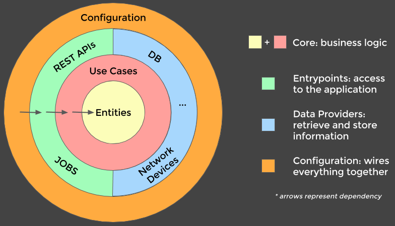

# Fibonacci Server  

[](https://travis-ci.org/Xicks/Fibonacci-Server)

Web server that calculates fibonacci values and store the results on PostgresSQL and Redis.

This is a learning project :)
## Prerequisites

In order to successfully run this project as well as develop in it you need to have the following installed:

* JDK 11+: [Linux](https://tecadmin.net/install-openjdk-java-ubuntu/)
* Kotlin 1.3.50: [Install](https://medium.com/@sushanthande1/install-kotlin-on-linux-ubuntu-1a3f97dffa40)
* Gradle 5: [Install](https://gradle.org/install/)
* Docker: [Linux](https://docs.docker.com/engine/installation/linux/docker-ce/ubuntu/#install-using-the-repository)
* Docker Compose: [Install](https://docs.docker.com/compose/install/)

## Technologies
- Gradle
- Kotlin
- Ktor
- Redis
- PostgresSQL

## Architecture
Based on Clean Architecture: [Reference](https://www.freecodecamp.org/news/a-quick-introduction-to-clean-architecture-990c014448d2/)



## Endpoints
`GET /fib` -> List all requested fibonacci indexes.

Example:
```json
[
  {
    "index": 5,
    "value": 5
  },
  {
    "index": 9,
    "value": 34
  }
]
```
`GET /fib/{index}` -> Get fibonacci `index` result.

Example:
```json
{
  "index": 10,
  "value": 55
}
```
## Environment Setup

### Downloading dependencies and installing a local version of the project

Download dependencies, compile the code and run the unit tests:

```
$ gradle clean build 
```

### Running tests

Run all tests:
```
$ gradle clean test
```

## Run Setup

### Running Locally

Start PostgresSQL and Redis and run the application:
```
$ make stack
$ gradle run
```
### Running on Docker

Start docker-compose:
```
$ docker-compose up
```

## Production Setup
### Generating production Jar
This is a multi module project that uses shadowJar to build a Jar from all dependencies:
```
$ gradle clean shadowJar -x test
```
### Generating Docker image
Build dockerfile:
```
$ docker build -t fibonacci-server .
```

